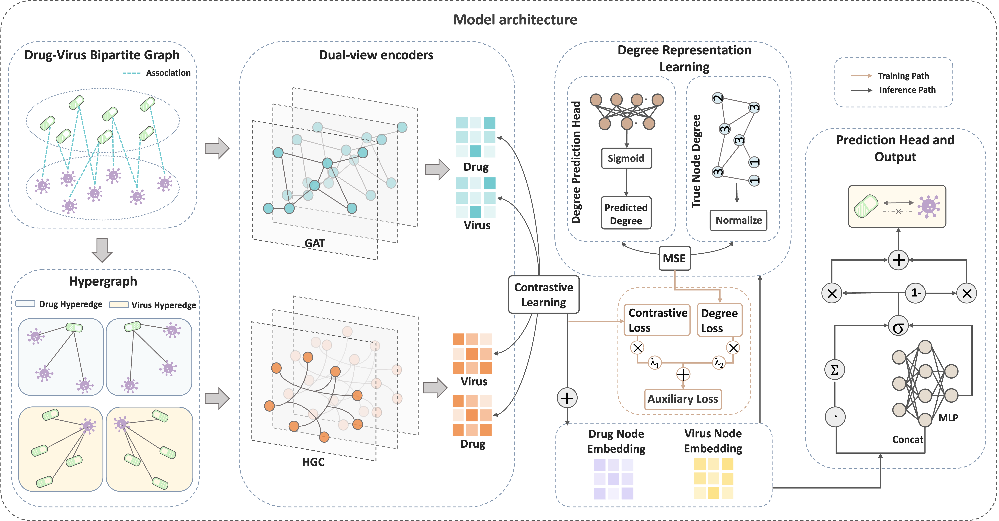

# Welcome to HyCoVDA: Self-Supervised Hypergraph Contrastive Learning for Virus–Drug Association
Viral infections remain a major threat to global public health. Although antiviral drugs can significantly reduce disease burden, traditional drug development approaches that depend on biological experiments are often time consuming, costly, and inefficient. Computational methods provide a viable alternative to accelerate the discovery of potential antiviral agents by prioritizing candidates for further validation. In this work, we propose HyCoVDA, a novel framework for predicting virus–drug associations. HyCoVDA learns node representations from two complementary structural views. The first view models direct drug–virus interactions using a bipartite graph attention network. The second view captures higher-order relationships through drug-specific and virus-specific hypergraphs. To address the sparsity of known associations, we integrate a self-supervised contrastive loss that aligns representations from the two views, encouraging consistent and robust embeddings. In addition, we introduce an auxiliary degree regression objective to preserve global topological information in the learned representations. A prediction head adaptively combines generalized matrix factorization and multilayer perceptron components to score candidate associations. Experimental results demonstrate that HyCoVDA achieves AUC and AUPR scores of 0.892 and 0.889, respectively, outperforming five benchmark methods. Moreover, in a case study on SARS-CoV-2, 17 of the top 20 predicted drugs are supported by existing experimental evidence, and molecular docking analysis of two unreported candidates suggests potential disruption of the spike–ACE2 interaction. Overall, HyCoVDA not only achieves high predictive accuracy but also identifies biologically plausible drug candidates, demonstrating its practical value in antiviral drug discovery.



## 🔧 Installation instructions

1. **Clone the repository**
```bash
git clone https://github.com/qj322/HyCoVDA.git
cd HyCoVDA
```
2. **Set up the Python environment**
```bash
conda create -n hycovda python=3.10
conda activate hycovda
pip install -r requirements.txt
```
## Model Training

Train the model from scratch:

```bash
python train.py
```
The training script will automatically save the model with the best validation to `best_model.pth`.

## Model Evaluation

Evaluate the trained model:

```bash
python eval.py
```
The script reports the following metrics:

* AUC
* AUPR
* Accuracy
* Precision
* Recall
* F1-score
